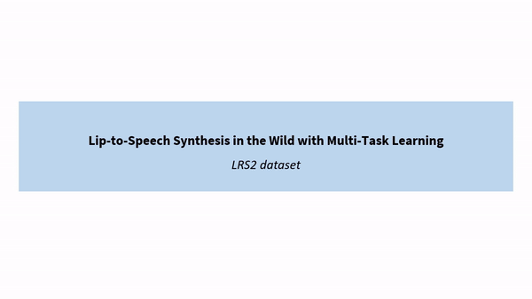

# Lip-to-Speech Synthesis in the Wild with Multi-task Learning

## Overview
This repository contains a video demo of IEEE International Conference on Acoustics, Speech and Signal Processing submitted paper titled "Lip-to-Speech Synthesis in the Wild with Multi-task Learning"

## Demo video
A demo video contains the original speech, the generated speech from previous state-of-the-art work <a id="1">[1]</a>, and the generated speech from the proposed method from three different speakers on both LRS2 and LRS3 datasets, respectively. The video demos are also availalbe in [here](https://github.com/joannahong/Lip-to-Speech-Synthesis-in-the-Wild/tree/main/demo-videos).

<example>
 

  

## References
  <a id="1">[1]</a> Rodrigo Mira, Alexandros Haliassos, Stavros Petridis, Bj̈orn W Schuller, and Maja Pantic, “Svts: Scalable video-to-speech synthesis,” arXiv preprint arXiv:2205.02058, 2022.
